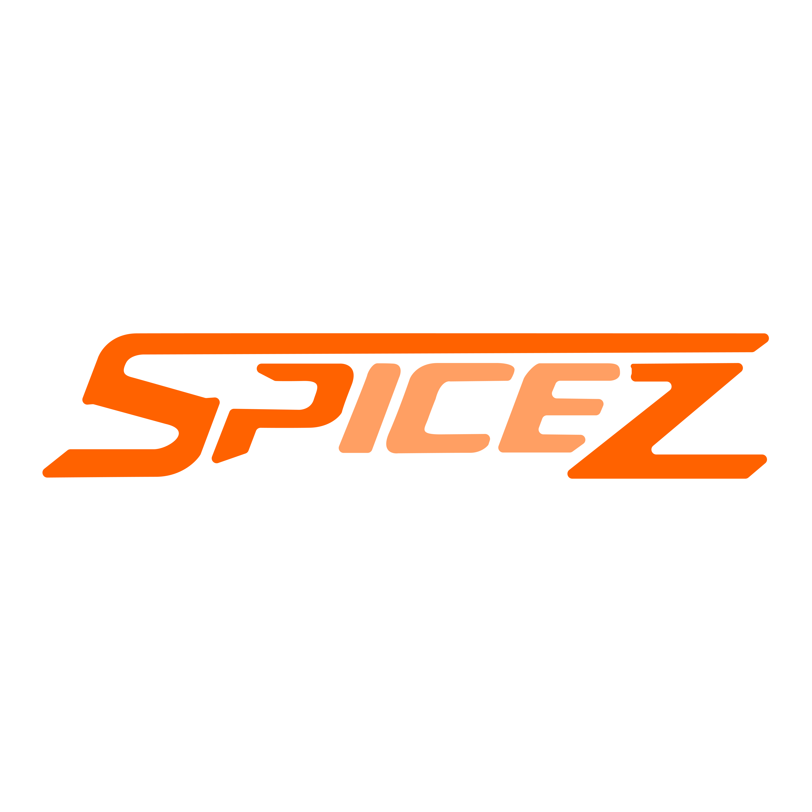
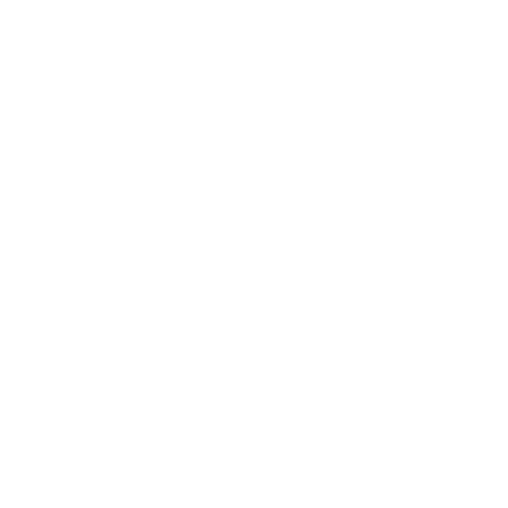
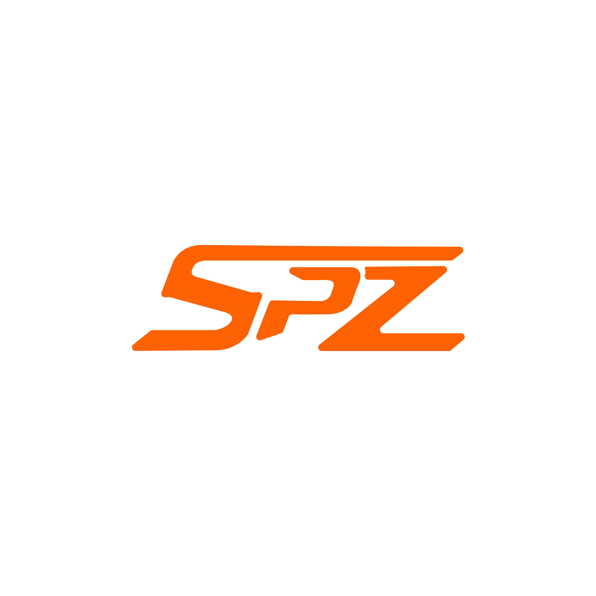
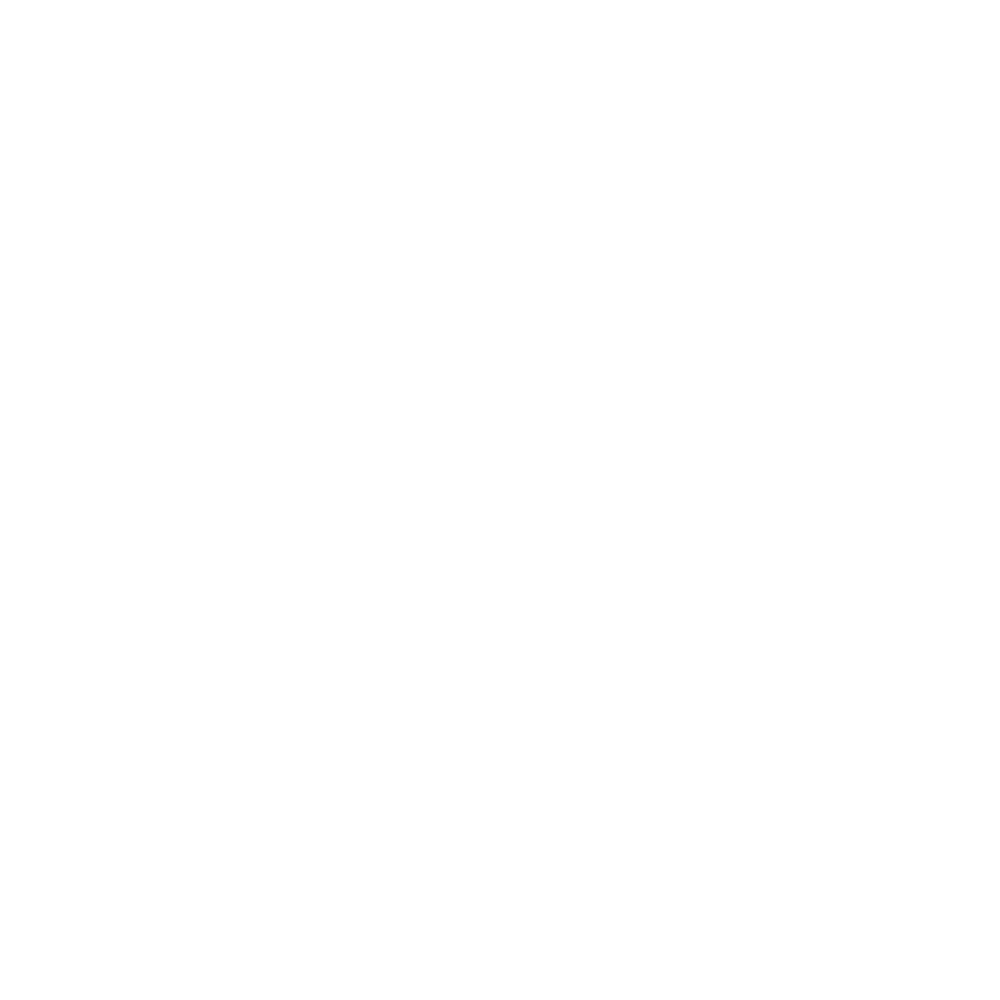

 

# spz-core-media-kit

### Official Brand Assets & Guidelines

*Logos, banners, and color palette for the SPiceZ-Core brand. Use these assets consistently across all SPiceZ materials.*

 

---

## Brand Guidelines

Before using any asset, follow these rules to maintain brand consistency:

- **Never stretch or distort** logos. Scale them proportionally only.
- **Maintain clear space** around the logo — at minimum the height of the SPZ icon on all sides.
- **Use transparent variants** on non-white or dark backgrounds to ensure proper contrast.
- **Do not recolor** logos or banners outside of approved palette swaps.

---

## Brand Colors

| # | Name | Hex | Swatch |
|---|---|---|---|
| 1 | Main Orange | `#FF6200` |  |
| 2 | Secondary Orange | `#FF9F63` |  |
| 3 | Black | `#000000` |  |
| 4 | White | `#FFFFFF` |  |

Use **Main Orange** (`#FF6200`) for accents, call-to-action buttons, and high-visibility elements. Secondary Orange is for highlights and softer UI elements. All primary surfaces should use Black or White.

---

## Logos

Available in both PNG (raster) and SVG (vector) formats.

### Long Format

| Asset | PNG Preview | SVG |
|---|---|---|
| Long SPZ #1 |  | [Download SVG](./Logo-Svg/long_spz_%231.svg) |
| Long SPZ #2 |  | [Download SVG](./Logo-Svg/long_spz_%232.svg) |
| Long SPZ #3 |  | [Download SVG](./Logo-Svg/long_spz_%233.svg) |
| Long Transparent |  | [Download SVG](./Logo-Svg/long_spz_transparent.svg) |
| Long Trans White |  | [Download SVG](./Logo-Svg/long_spz_transparent_white.svg) |

### Short Format

| Asset | PNG Preview | SVG |
|---|---|---|
| Short SPZ #1 |  | [Download SVG](./Logo-Svg/short_spz_%231.svg) |
| Short SPZ #2 |  | [Download SVG](./Logo-Svg/short_spz_%232.svg) |
| Short SPZ #2-1 |  | [Download SVG](./Logo-Svg/short_spz_%232-1.svg) |
| Short Transparent |  | [Download SVG](./Logo-Svg/short_spz_transparent.svg) |
| Short Trans White |  | [Download SVG](./Logo-Svg/short_spz_transparent_white.svg) |

---

## Banners

Use these banners for social media headers, event promotions, newsletters, or website heroes.

| Banner | Preview | Recommended Use |
|---|---|---|
| Banner #1 |  | Primary event and general promotion |
| Banner #2 |  | Secondary event promotion, README headers |
| Banner #3 |  | Dark theme placements |
| Banner #4 |  | Hero image layout, content pages |
| Banner #5 |  | Social media landscape (Twitter/X cover) |
| Banner #6 |  | Newsletter and blog headers |

> Banner #2 is the standard header used across all `spz-*` module READMEs.

---

## File Formats

| Format | Best For |
|---|---|
| `.png` | Web use, READMEs, social media |
| `.svg` | Print, high-DPI displays, scalable UI |
| `_transparent` variants | Overlaying on colored or dark backgrounds |
| `_white` variants | Dark backgrounds where the standard version lacks contrast |

---

## Contact

For press inquiries, interviews, or specific asset requests not available here, reach out through the [SPiceZ-Core Discord](https://discord.gg/).

---

*Part of the [SPiceZ-Core](https://github.com/SPiceZ-Core) ecosystem*

**[Discord](https://discord.gg/) · [GitHub Org](https://github.com/SPiceZ-Core)**

